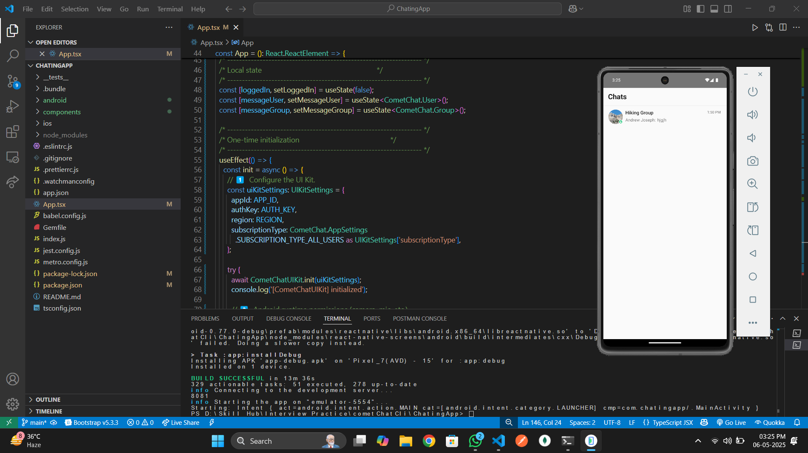

# CometChat Integration in React Native


**Detailed Report:** [View Full Report](https://drive.google.com/file/d/1iV4mUaaHJH13sBWXC_E806jUoPonHdRK/view?usp=sharing)

### 📱 Download Working APK  
[Click here to download the working APK](https://drive.google.com/file/d/1TJFSAIb03FPdomOMzeCyvJAuRwjfEuGT/view?usp=sharing)


## Objective
To integrate CometChat's chat functionality into a React Native project with support for:
- User signup and login
- One-to-one chat functionality

## Implementation Overview

### User Authentication & Chat Functionality
- Implemented user signup and login using CometChat's SDK
- Enabled one-to-one real-time chat via CometChat's pre-built UI Kit
- User authentication and chat logic handled entirely through CometChat's BaaS model
- Eliminated the need for a separate backend

## Development Process

### Expo vs React Native CLI
- Initially started with Expo (`npx create-expo-app`) for quicker setup
- Discovered CometChat UI Kit is incompatible with Expo Go (requires native modules)
- Ejected from Expo using `npx expo eject` and migrated to React Native CLI
- Post-ejection, Expo Go could no longer be used for testing
- Gained valuable experience setting up React Native CLI environment:
  - Installed Android Studio, Node.js, Chocolatey, JDK
  - Configured environment variables

## Build & Gradle Configuration Challenges

### ADB Not Recognized
**Error:**  
`'adb' is not recognized as an internal or external command`

**Solution:**  
Added Android SDK platform-tools to PATH:  
`C:\Users\mohdf\AppData\Local\Android\Sdk\platform-tools`

### Gradle Version Mismatch
**Issue:**  
Multiple Gradle-related build errors post-ejection due to version mismatch

**Resolution:**
1. Upgraded to Gradle version 8.11.1:
   ```gradle
   classpath("com.android.tools.build:gradle:8.11.1")
   distributionUrl=https\://services.gradle.org/distributions/gradle-8.11.1-all.zip

   Cleaned and rebuilt project:

bash
cd android
./gradlew clean
cd ..
npx react-native run-android
Note: This was a React Native ecosystem issue, not specific to CometChat.

##Slow Build Times
Initial builds took 30-40 minutes due to hardware limitations.

CometChat Documentation Feedback
Well-structured documentation for experienced developers

Suggestion: Explicitly mention UI Kit's incompatibility with Expo Go in Getting Started section

Adding direct hyperlinks to Expo setup instructions would enhance accessibility

Additional Build & Integration Challenges
Login/init failed after initial successful integration

App stuck in "initializing" phase on subsequent launches

Debugged using React Developer Tools, found pending login request state

Resolved by creating fresh React Native CLI project and reimplementing features

UI/UX Feedback on CometChat Website
1. App Integration Page Horizontal Scroll
Click-and-drag interaction not intuitive for beginners

Recommendation: Add arrow-based scroll or clear UI cues

2. Login-to-Dashboard Transition Lag
Login screen briefly appears after authentication

Recommendation: Immediate dashboard transition for authenticated users

3. Pixelated Splash Logo
Mobile logo appears pixelated

Recommendation: Use high-resolution or vector image

4. Card Design Overlap on App Dashboard
Minor visual misalignment creates clutter

## 🖼️ Screenshots

### Authentication Flow
| Login Screen | Signup Screen | Navigation |
|--------------|---------------|------------|
|  |  |  |

### Chat Interface
| Conversation | Users List | Initial Setup |
|--------------|------------|---------------|
|  |  |  |

### UI Observations
| Card Overlap | Auth Glitch |
|--------------|-------------|
|  |  |

Technologies Used
React Native CLI
CometChat SDK + UI Kit
TypeScript (first implementation)
Android Studio + Emulator + USB Debugging
Expo (initial), later ejected to CLI

Outcome
Successfully integrated CometChat's UI Kit in React Native CLI app
Implemented authentication and real-time one-to-one chat
Gained hands-on experience with:
Native module management
React Native CLI environment setup
Gradle configuration
Android build debugging
Emulator and physical device testing

Conclusion
This integration provided valuable technical experience with native modules, Gradle, and environment setup. The CometChat SDK performed well, with challenges primarily related to development setup. Documentation improvements for Expo users would enhance the beginner experience.

🔗 Project Links
- [GitHub Repository](https://github.com/Farhan22798/cometChat)

## 📚 References

Official Documentation
[Expo Ejection Guide](https://docs.expo.dev/bare/exploring-bare-workflow/)
[React Navigation Docs](https://reactnavigation.org/docs/getting-started)
[React Native Environment Setup](https://reactnative.dev/docs/environment-setup)
CometChat React Native UI Kit
React Native CLI Setup
Expo Ejection Guide
React Navigation
TypeScript in React Native
CometChat Authentication

##YouTube Tutorials
CometChat Integration Walkthrough
React Native CLI Setup for CometChat
Fixing Login/Init Errors
CLI Initialization Fixes
Project Setup & Navigation


## 👨💻 Contact
- [Portfolio](https://portfolio-farhan-ahmeds-projects-10079003.vercel.app)
- [GitHub](https://github.com/Farhan22798)
- [Email](mailto:mohdfarhan227@gmail.com)


